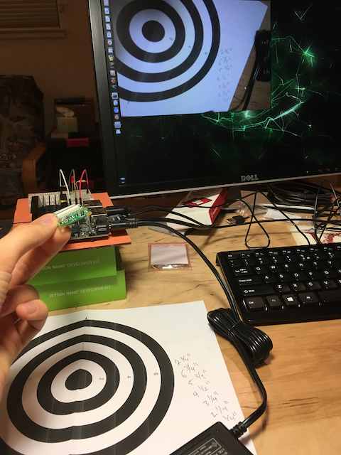

# Depth Calibration
A quick test to verify the view angle for the Raspberry Pi camera.

## Technical Parameters
The [eLinux Wiki](https://elinux.org/Rpi_Camera_Module#Technical_Parameters_.28v.2_board.29) provides the following information about the camera:

- Sensor type: Sony IMX219PQ[7] Color CMOS 8-megapixel
- Sensor size: 3.674 x 2.760 mm (1/4" format)
- Pixel Count: 3280 x 2464 (active pixels) 3296 x 2512 (total pixels)
- Pixel Size: 1.12 x 1.12 um
- Lens: f=3.04 mm, f/2.0
- Angle of View: 62.2 x 48.8 degrees
- Full-frame SLR lens equivalent: 29 mm
- Video Modes:
- 1 - 1080P30 cropped (680 pixels off left/right, 692 pixels off top/bottom), up to 30fps
- 2 - 3240x2464 Full 4:3, up to 15fps
- 3 - 3240x2464 Full 4:3, up to 15fps (identical to 2)
- 4 - 1640x1232 binned 4:3, up 40fps
- 5 - 1640x922 2x2 binned 16:9 (310 px crop T/B before binning), up to 40fps
- 6 - 720P bin+crop (360 px L/R, 512 px T/B before binning), 40..90fps (OC: 120fps)
- 7 - VGA bin+crop (1000 px L/R, 752 px T/B before binning), 40..90fps (OC: 120fps)
- Board size: 25 x 23.86 x 9mm
- Mounting Holes: 4x D=2.20 mm on 12.5 x 21.0 mm centers

## Emperical Results
By measuring the distance between the camera and the calibrated target, we determined that the camera has a view angle of ~45 degrees, which is close enough to verify the 48.8 degrees in the spec

